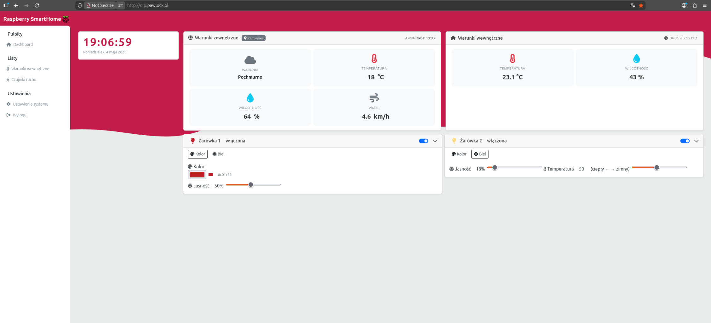
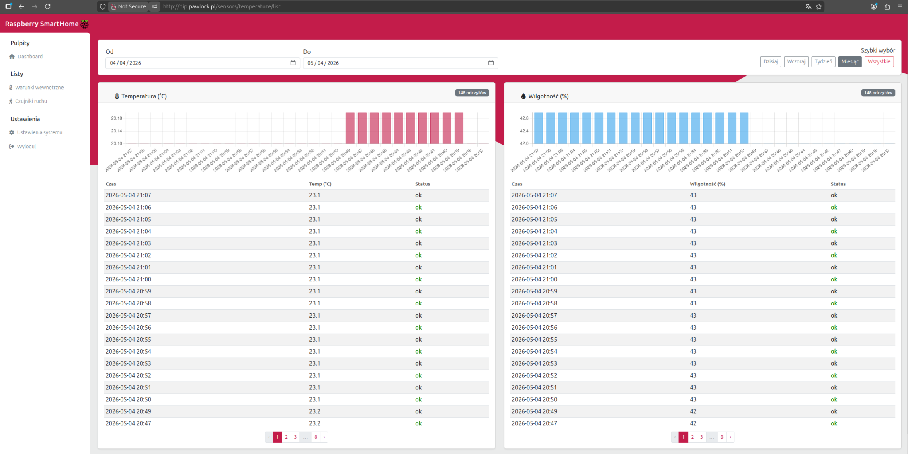

# RaspberrySmartHome

A web-based Smart Home dashboard built with Laravel and MongoDB, running on a Raspberry Pi. Collects data from sensors, displays live readings with charts, and lets you control RGB smart bulbs from a browser.

---

## Screenshots

```
docs/
└── screenshots/
    ├── dashboard.png
    └── temperature_list.png
```

**Dashboard**



**Temperature & Humidity**



---

## Features

**Sensor Monitoring**
- Temperature & Humidity — stores historical readings from an internal sensor; supports date range filtering with Chart.js charts and a data table
- Motion Detection — captures distance readings from a proximity sensor with the same filtering and chart support

**Smart Bulb Control**

Communicates with a local REST API on the Pi to control two RGB bulbs:
- Turn individual bulbs on/off
- Set a custom RGB color per bulb
- Adjust brightness (0–100%)
- White light mode with adjustable warm/cool color temperature

**Weather Widget**

Pulls live outdoor weather from the [Open-Meteo API](https://open-meteo.com/) based on the user's saved coordinates — temperature, humidity, wind speed, and a short description.

**Authentication**

Session-based login/logout without Breeze or Sanctum. Passwords are hashed, routes are protected via a custom `AuthMiddleware`.

**User Settings**

Each user stores their location (lat/lon + display name), which drives the weather widget.

---

## Tech Stack

| Layer | Technology |
|---|---|
| Backend | PHP 8.2, Laravel 12 |
| Database | MongoDB via `mongodb/laravel-mongodb` 5.6 |
| Frontend | Blade templates, Bootstrap 5.3, Chart.js |
| Icons | Font Awesome |
| Sensor data | Raspberry Pi (pushes to MongoDB) |
| Bulb control | Local REST API on the Pi |
| Weather | Open-Meteo API (no API key required) |

---

## Project Structure

```
app/Http/Controllers/
├── LoginController.php       # Login / logout
├── RegisterController.php    # User registration
├── DashboardController.php   # Main dashboard view
├── SensorController.php      # Temperature & motion data + AJAX endpoints
├── BulbApiController.php     # Smart bulb proxy (on/off/color/brightness/white)
├── WeatherController.php     # Live weather from Open-Meteo
└── SettingsController.php    # User location settings

app/Http/Middleware/
└── AuthMiddleware.php        # Session-based route protection

app/Models/
├── User.php                  # MongoDB user model
├── TemperatureReading.php    # Temperature + humidity readings
└── DistanceReading.php       # Motion sensor readings
```

---

## Environment Variables

```env
BULB_API_URL=http://<raspberry-pi-ip>   # Base URL of the local bulb REST API
```

---


## License

MIT